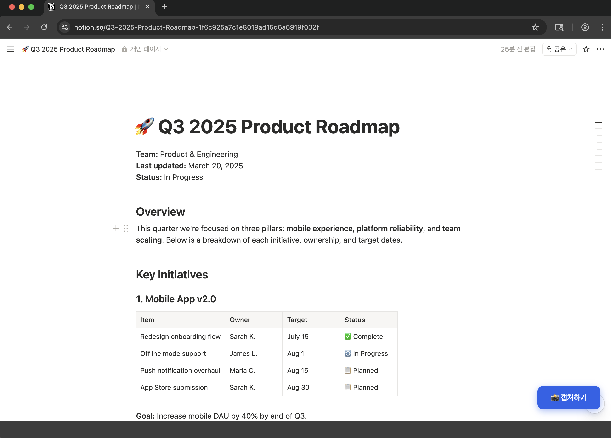
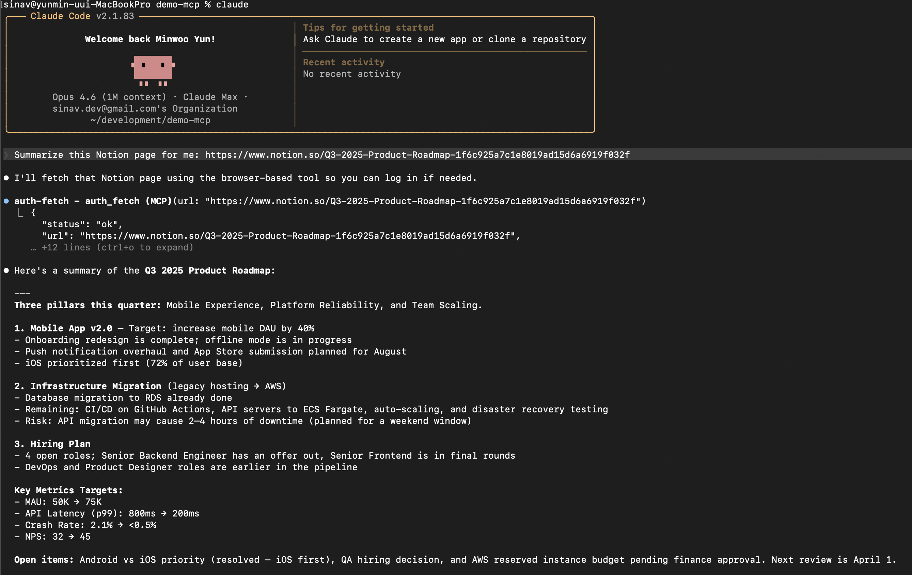

# auth-fetch-mcp

[](https://www.npmjs.com/package/auth-fetch-mcp)
[](https://www.npmjs.com/package/auth-fetch-mcp)
[](https://opensource.org/licenses/MIT)
[](https://glama.ai/mcp/servers/ymw0407/auth-fetch-mcp)

MCP server that lets AI assistants fetch content from authenticated web pages.

When your AI tries to read a URL that requires login, this tool opens a real browser for you to sign in — then captures the page content. Sessions are saved locally, so you only log in once per service.

## Demo

> "Summarize this Notion page for me"

A browser opens with a **Capture** button. Log in if needed, then click it:



The AI receives the full page content and responds:



## Quick Start

### Claude Code

```bash
claude mcp add --scope user auth-fetch -- npx auth-fetch-mcp@latest
```

### .mcp.json (Cursor, Windsurf, etc.)

```json
{
  "mcpServers": {
    "auth-fetch": {
      "command": "npx",
      "args": ["auth-fetch-mcp@latest"]
    }
  }
}
```

Chromium is auto-installed on first run if not already present.

## How It Works

1. Ask your AI to read any authenticated page — just paste the URL.
2. A browser window opens automatically and navigates to the page.
3. Log in as you normally would (supports SSO, 2FA, CAPTCHA — anything).
4. Click the **"📸 Capture"** button in the bottom-right corner when ready.
5. The page content is captured, the browser closes, and your AI receives the content.

## Tools

### `auth_fetch`

The primary tool. Fetches page content using a real browser, opening a window for login if needed.

| Parameter  | Type   | Required | Description |
|-----------|--------|----------|-------------|
| `url`     | string | yes      | The URL to fetch content from |
| `wait_for`| string | no       | CSS selector to wait for before capturing (useful for SPAs) |

**Flow:**
1. Opens a headed browser and navigates to the URL
2. A floating **"📸 Capture"** button appears on the page
3. User logs in or navigates as needed (button re-appears after page transitions)
4. User clicks the button — content is captured as Markdown — browser closes

### `list_pages`

Lists all open tabs in the browser with their URLs and titles.

### `close_browser`

Closes the browser window. Login sessions are saved and will be reused next time.

## How Sessions Work

Login sessions are saved to `~/.auth-fetch-mcp/browser-data/`. This is a standard Chromium profile directory containing cookies and local storage. Sessions persist across restarts, so previously logged-in sites will load faster on the next visit.

To clear all sessions:
```bash
rm -rf ~/.auth-fetch-mcp/browser-data/
```

## Supported AI Tools

- Claude Code
- Cursor
- Windsurf
- Any MCP-compatible client using stdio transport

## Limitations

- Requires a local environment (does not work in web-based chat interfaces)
- First access to each service requires manual login
- Very long pages are truncated to fit LLM context windows (50K chars)
- Some sites with aggressive bot detection may not work (try the `wait_for` option)

## Privacy

- All data stays on your machine — nothing is sent to external servers
- Browser sessions are stored locally in your home directory
- The MCP server only communicates with the AI tool via stdio (local pipe)

## Contributing

Contributions are welcome! Please open an issue or submit a pull request.

```bash
git clone https://github.com/ymw0407/auth-fetch-mcp.git
cd auth-fetch-mcp
npm install
npm run build
```

## License

MIT
