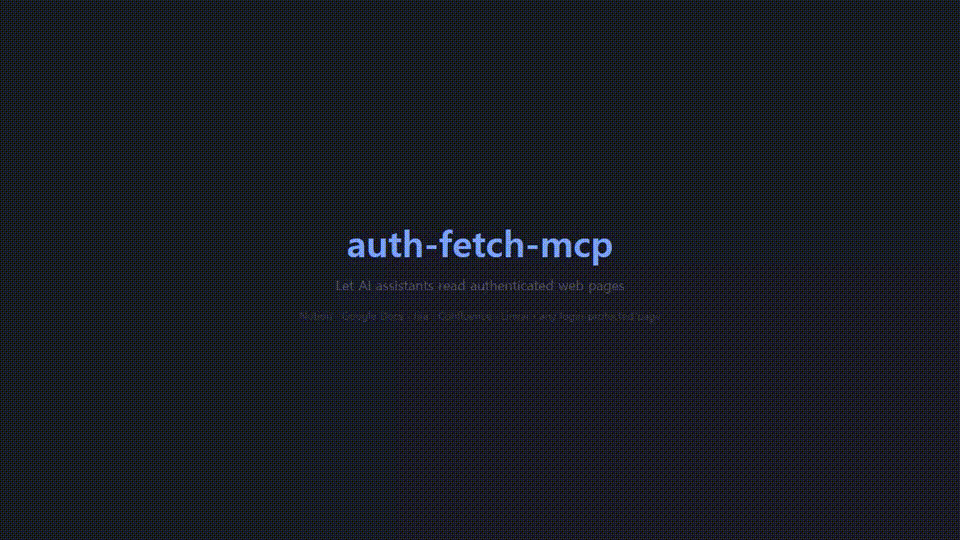

# auth-fetch-mcp

[](https://www.npmjs.com/package/auth-fetch-mcp)
[](https://www.npmjs.com/package/auth-fetch-mcp)
[](https://opensource.org/licenses/MIT)
[](https://glama.ai/mcp/servers/ymw0407/auth-fetch-mcp)

MCP server that lets AI assistants fetch content from authenticated web pages.

When your AI tries to read a URL that requires login, this tool opens a real browser for you to sign in — then captures the page content as cleaned HTML. Sessions are saved locally, so you only log in once per service.

## Demo



## Quick Start

### Claude Code

```bash
claude mcp add --scope user auth-fetch -- npx auth-fetch-mcp@latest
```

### .mcp.json (Cursor, Windsurf, etc.)

```json
{
  "mcpServers": {
    "auth-fetch": {
      "command": "npx",
      "args": ["auth-fetch-mcp@latest"]
    }
  }
}
```

Chromium is auto-installed on first run if not already present.

## How It Works

1. Ask your AI to read any authenticated page — just paste the URL.
2. A browser window opens automatically and navigates to the page.
3. Log in as you normally would (supports SSO, 2FA, CAPTCHA — anything).
4. Click the **"📸 Capture"** button in the bottom-right corner when ready.
5. The page content is captured as cleaned HTML (noise elements stripped, media tags preserved), the browser closes, and your AI receives the content.

## Tools

### `auth_fetch`

The primary tool. Fetches page content using a real browser, opening a window for login if needed. Returns cleaned HTML with noise elements (nav, footer, scripts, etc.) stripped and media tags (``, `<video>`, `<iframe>`) preserved.

| Parameter  | Type   | Required | Description |
|-----------|--------|----------|-------------|
| `url`     | string | yes      | The URL to fetch content from |
| `wait_for`| string | no       | CSS selector to wait for before capturing (useful for SPAs) |

### `download_media`

Downloads files from URLs using saved browser sessions. Use this to lazily download images, videos, or other files found in `auth_fetch` results. The browser's saved cookies handle authentication automatically — no need to log in again.

| Parameter    | Type     | Required | Description |
|-------------|----------|----------|-------------|
| `urls`      | string[] | yes      | One or more URLs to download |
| `output_dir`| string   | no       | Directory to save files to (defaults to `~/.auth-fetch-mcp/downloads/<timestamp>/`) |

**Example flow:**

```
1. auth_fetch("https://notion.so/my-page")
   → Returns HTML with  tags

2. AI reads the HTML, identifies an image it needs

3. download_media(["https://s3.notion.so/signed-url..."])
   → Downloads the image using saved session cookies
   → Returns { localPath: "~/.auth-fetch-mcp/downloads/.../file-1.png" }
```

### `list_pages`

Lists all open tabs in the browser with their URLs and titles.

### `close_browser`

Closes the browser window. Login sessions are saved and will be reused next time.

## Data Storage

All data is stored locally under `~/.auth-fetch-mcp/`. Nothing is sent to external servers.

| What | Where | When | Persistent? |
|------|-------|------|-------------|
| Browser sessions (cookies, local storage) | `~/.auth-fetch-mcp/browser-data/` | After first login | Yes — reused across restarts |
| Downloaded media files | `~/.auth-fetch-mcp/downloads/<timestamp>/` | Only when `download_media` is called | Yes — stays until you delete it |
| Captured page content (HTML) | Not saved to disk | Passed directly to AI via stdio | No — exists only in the AI's context |

To clear all data:
```bash
# Clear login sessions only
rm -rf ~/.auth-fetch-mcp/browser-data/

# Clear downloaded files only
rm -rf ~/.auth-fetch-mcp/downloads/

# Clear everything
rm -rf ~/.auth-fetch-mcp/
```

## Supported AI Tools

- Claude Code
- Cursor
- Windsurf
- Any MCP-compatible client using stdio transport

## Limitations

- Requires a local environment (does not work in web-based chat interfaces)
- First access to each service requires manual login
- Very long pages are truncated to fit LLM context windows (100K chars)
- Some sites with aggressive bot detection may not work (try the `wait_for` option)

## Privacy

- All data stays on your machine — nothing is sent to external servers
- Captured HTML is never written to disk — it only passes through the stdio pipe to the AI tool
- Browser sessions are stored locally as a standard Chromium profile
- Downloaded files go to a local directory you control

## Contributing

Contributions are welcome! Please open an issue or submit a pull request.

```bash
git clone https://github.com/ymw0407/auth-fetch-mcp.git
cd auth-fetch-mcp
npm install
npm run build
```

## License

MIT
